# Báo cáo Lab Day 1 — MSSV 2A202603007

**Mã số sinh viên:** 2A202603007  
**Bài toán:** Phân loại 7 loại rừng Forest CoverType (UCI Machine Learning Repository)  
**Tập dữ liệu:** 581 012 mẫu, 54 đặc trưng (10 đặc trưng số địa hình liên tục và 44 cột nhị phân one-hot Wilderness Area & Soil Type)

---

## 1. Thiết lập

- **Môi trường:** Local Windows 11, GPU NVIDIA GeForce RTX 4060 Laptop GPU (8GB VRAM), PyTorch `2.8.0+cu129`, CUDA 12.9, hỗ trợ phần cứng Native BF16.
- **Dữ liệu:** Phân chia theo `data/split_metadata.csv` gồm tập `train` (464 809 mẫu) và tập `eval` (116 203 mẫu). Tập `train` được tách 20% làm `validation` phân tầng theo nhãn (`stratified`, seed 42) $\rightarrow$ **371 847 mẫu train** / **92 962 mẫu val**. Toàn bộ tham số chuẩn hoá (mean, std của 10 cột số đầu tiên) được tính toán **chỉ trên 371 847 mẫu train** và áp dụng cho val/eval nhằm chống rò rỉ dữ liệu (*data leakage*).
- **Kiến trúc mô hình:** Mạng MLP chuẩn theo quy định `M-base` ($54 \rightarrow 256 \rightarrow 128 \rightarrow 7$, đúng **47 879 tham số**). Lớp ra trả về logits thô (không đặt softmax trong mô hình).
- **Baseline:** Mất mát Cross-Entropy, bộ tối ưu SGD + momentum 0.9, tốc độ học $lr=0.05$, kích thước lô $batch=512$, số epoch = 20, khởi tạo He normal, không dropout, không clip, độ chính xác FP32.
- **Mốc tham chiếu:** Độ chính xác chiến lược "luôn đoán lớp đa số" (lớp 1) trên tập validation $= 0.4876$ (macro-F1 $\approx 0.0936$). Mọi mô hình huấn luyện hợp lệ bắt buộc phải vượt xa mốc này.
- **Độ phủ chủ đề:** Đã thực hiện đầy đủ **7/7 chủ đề** theo quy định:
  - [x] Hàm mất mát (`loss`)
  - [x] Bộ tối ưu hoá (`optimizer`)
  - [x] Siêu tham số (`hparam`)
  - [x] Dropout (`dropout`)
  - [x] Cắt gradient (`clipping`)
  - [x] Mixed precision (`amp`)
  - [x] Khởi tạo tham số (`init`)

---

## 2. Kiểm tra ban đầu và độ nhiễu

| Phép kiểm tra | Kết quả đo được | Đánh giá & Chuẩn mực |
|---|---|---|
| Số tham số / shape logits | 47 879 / `(B, 7)` | Khớp chính xác `EXPECTED_PARAMS[(256, 128)]`, `assert` thành công |
| Loss bước 0 trên Val | **1.9635** | Sai lệch chỉ 0.0176 so với $\ln 7 \approx 1.9459$ |
| Quá khớp 20 mẫu (Overfitting) | Loss = $2.0 \times 10^{-6}$, Acc = **100.0%** | Hội tụ tuyệt đối sau 300 bước, không lỗi code |
| Dòng chảy Gradient | Tất cả tham số đều có gradient $> 0$ | Chuẩn L2: `net.0` (0.55), `net.2` (1.81), `net.4` (1.92) |
| Baseline: Số seed đã chạy | **3 seed** (`base-s1`, `base-s2`, `base-s3`) | Đạt yêu cầu $\ge 2$ seed để đo độ lệch chuẩn |
| Baseline Val Accuracy (TB ± $\sigma$) | **0.9016 ± 0.0011** | $0.9011$ (s1), $0.9029$ (s2), $0.9008$ (s3) |
| Baseline Val Macro-F1 (TB ± $\sigma$) | **0.8422 ± 0.0063** | $0.8399$ (s1), $0.8374$ (s2), $0.8493$ (s3) |

**Ngưỡng nhiễu thống kê dùng trong báo cáo:**
$$\sigma_{F1} = 0.0063 \implies 2\sigma = \mathbf{0.0126} \quad (\text{trên chỉ số Val Macro-F1})$$
Mọi kết luận so sánh "cấu hình A tốt hơn B" bắt buộc phải có mức cải thiện chênh lệch $\Delta \text{Macro-F1} > 0.0126$; nếu nhỏ hơn ngưỡng này, chênh lệch được xem là nằm trong vùng dao động ngẫu nhiên của hạt giống (seed noise) và chưa đủ bằng chứng kết luận.

---

## 3. Kết quả theo từng chủ đề

### 3.1 Hàm mất mát — Cross-Entropy vs. MSE
- **Dự đoán trước khi chạy:** Cross-Entropy (CE) sẽ vượt trội hoàn toàn so với MSE. Với bài toán phân loại đa lớp, đạo hàm của hàm CE theo logit $z_i$ là $\frac{\partial \mathcal{L}_{CE}}{\partial z_i} = p_i - y_i$, tỷ lệ tuyến tính với độ lệch dự đoán và không bao giờ bị bão hoà khi dự đoán sai lệch lớn. Ngược lại, MSE tính trên đầu ra softmax có đạo hàm nhân thêm thành phần $p_i(1 - p_i)$, gây hiện tượng triệt tiêu gradient (*gradient vanishing*) khi mô hình dự đoán tự tin nhưng sai nhãn.
- **Kết quả đo lường:**
  - `loss-ce` (`base-s1`, ảnh 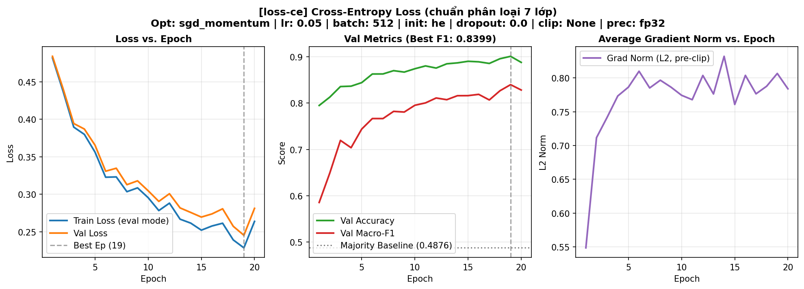): Val Acc = **0.9011**, Val Macro-F1 = **0.8399**, Best Epoch = 19.
  - `loss-mse` (ảnh 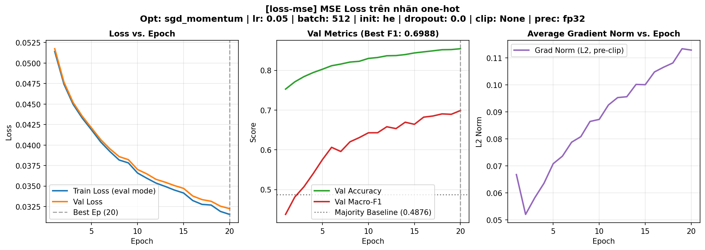): Val Acc = **0.8544**, Val Macro-F1 = **0.6988**, Best Epoch = 20.
  - Ảnh so sánh nhóm: 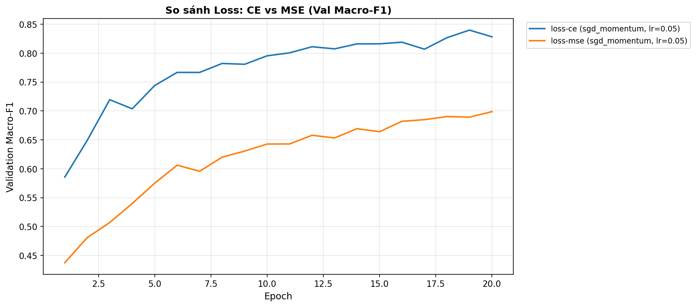.
- **Giải thích cơ chế:**
  - Chênh lệch Macro-F1: $\Delta = 0.8399 - 0.6988 = \mathbf{+0.1411}$, vượt xa ngưỡng nhiễu $2\sigma = 0.0126$.
  - Lưu ý phương pháp: Hai hàm mất mát có thang đo khác nhau ($CE \approx 0.24$, $MSE \approx 0.027$) nên tuyệt đối không so sánh trực tiếp giá trị loss, mà so sánh thông qua **Accuracy và Macro-F1**. Do dữ liệu CoverType mất cân bằng nặng (lớp 3 chỉ chiếm 0.5%), hiệu ứng triệt tiêu gradient của MSE khiến mô hình hầu như không thể phân tách được các lớp thiểu số, dẫn đến sụt giảm nghiêm trọng macro-F1.

### 3.2 Bộ tối ưu hoá — SGD, SGD+Momentum, Adam, AdamW
- **Dự đoán trước khi chạy:** 
  1. Adam và AdamW sẽ hội tụ nhanh hơn và đạt kết quả cao hơn SGD/SGDM nhờ khả năng tự thích ứng tốc độ học riêng cho từng trọng số dựa trên ước lượng moment bậc 1 và bậc 2.
  2. AdamW với $weight\_decay=0$ sẽ cho kết quả và đường cong đồng nhất $100\%$ với Adam chuẩn.
- **Bảng so sánh công bằng tại tốc độ học tối ưu của từng bộ tối ưu:**

| Bộ tối ưu | Thí nghiệm đại diện | Tốc độ học ($lr$) | Weight Decay | Val Accuracy | **Val Macro-F1** | Best Epoch |
|---|---|---|---|---|---|---|
| SGD (thuần) | `opt-sgd-lr0.2` | 0.2 | 0.0 | 0.8709 | 0.7904 | 18 |
| SGD + Momentum | `opt-sgdm-lr0.1` | 0.1 | 0.0 | 0.9070 | 0.8411 | 20 |
| Adam | `opt-adam-lr3e-3` | 0.003 | 0.0 | 0.9162 | 0.8709 | 19 |
| **AdamW** | `opt-adamw-lr3e-3` | **0.003** | **0.01** | **0.9138** | **0.8746** | **20** |

- **Độ nhạy với learning rate:**
  - Với SGD: tăng $lr$ từ $0.05 \rightarrow 0.2$ tăng vọt Macro-F1 từ $0.6925 \rightarrow 0.7904$ (SGD cần lr lớn để vượt qua các vùng phẳng).
  - Với SGDM: $lr=0.01$ (F1 = 0.7643) $\rightarrow lr=0.05$ (F1 = 0.8399) $\rightarrow lr=0.1$ (F1 = 0.8411).
  - Với Adam: $lr=3\times 10^{-4}$ (F1 = 0.7950) $\rightarrow lr=10^{-3}$ (F1 = 0.8512) $\rightarrow lr=3\times 10^{-3}$ (F1 = 0.8709).
  - Đồ thị so sánh: 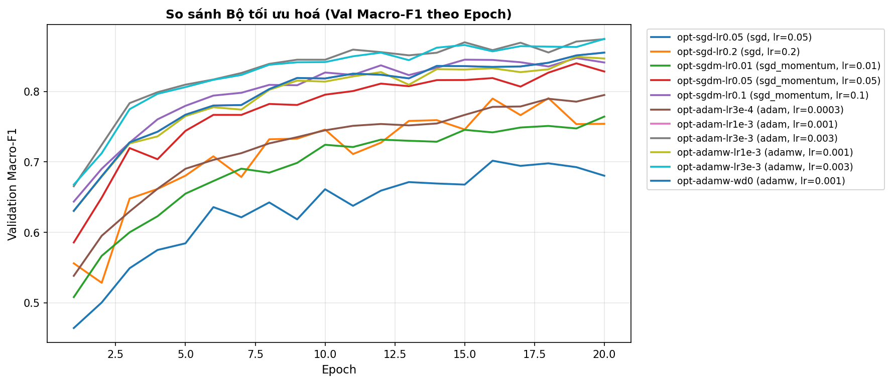 và 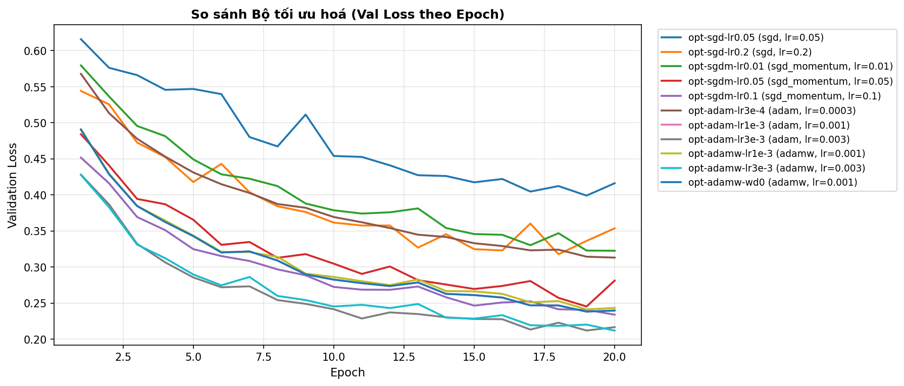.
- **Kiểm chứng cơ chế AdamW tách biệt Weight Decay:**
  - `opt-adam-lr1e-3` ($wd=0$): Val Acc = **0.9042**, Val Macro-F1 = **0.8512**, Best Epoch = 19.
  - `opt-adamw-wd0` ($wd=0$): Val Acc = **0.9042**, Val Macro-F1 = **0.8512**, Best Epoch = 19.
  - Kết quả khớp nhau đến từng chữ số thập phân, chứng minh chính xác công thức toán học: khi $\lambda = 0$, phương trình cập nhật của AdamW $w_{t+1} = w_t - \eta \lambda w_t - \eta \frac{\hat{m}_t}{\sqrt{\hat{v}_t} + \epsilon}$ trở về đúng dạng của Adam chuẩn. Khi bật $\lambda = 0.01$ ở $lr=3\times 10^{-3}$, AdamW đạt Macro-F1 $= 0.8746$, vượt baseline $+0.0324$ ($> 2\sigma$).

### 3.3 Siêu tham số — Kích thước lô, Độ rộng và Độ sâu mô hình
- **Dự đoán trước khi chạy:** 
  1. Với cùng số epoch (20), batch size nhỏ hơn sẽ thực hiện nhiều bước cập nhật trọng số hơn nên sẽ hội tụ nhanh hơn.
  2. Mạng `M-wide` (512-256) và `M-deep` (256-128-64) có năng lực biểu diễn cao hơn `M-base` nên sẽ cải thiện độ chính xác phân loại.
- **Kết quả đo lường:**
  - Kích thước lô (cùng baseline $lr=0.05$):
    - `hp-batch-128` (ảnh 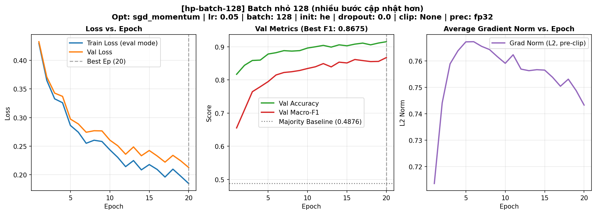): 2 905 bước/epoch $\rightarrow$ Val Acc = **0.9154**, Val Macro-F1 = **0.8675** (Best Ep 20).
    - `hp-batch-512` (`base-s1`, ảnh ): 727 bước/epoch $\rightarrow$ Val Acc = **0.9011**, Val Macro-F1 = **0.8399** (Best Ep 19).
    - `hp-batch-2048` (ảnh 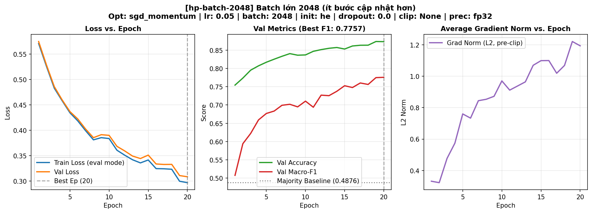): 182 bước/epoch $\rightarrow$ Val Acc = **0.8732**, Val Macro-F1 = **0.7757** (Best Ep 20).
  - Kiến trúc mô hình:
    - `M-base` (47 879 tham số): Val Macro-F1 = **0.8399**.
    - `hp-arch-wide` (`M-wide`, 161 287 tham số, ảnh 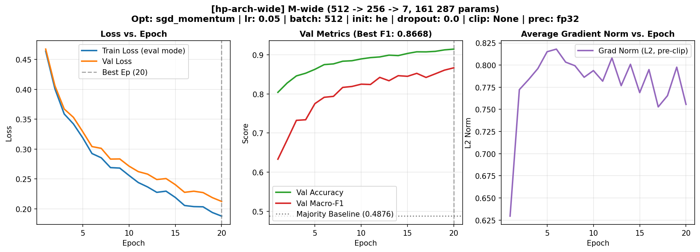): Val Acc = **0.9146**, Val Macro-F1 = **0.8668**.
    - `hp-arch-deep` (`M-deep`, 55 687 tham số, ảnh 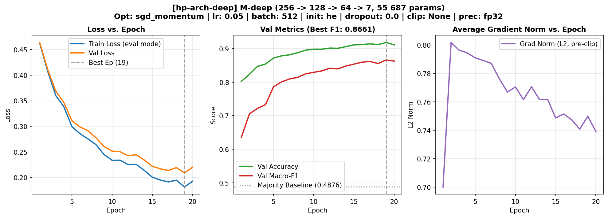): Val Acc = **0.9182**, Val Macro-F1 = **0.8661**.
  - Đồ thị so sánh: 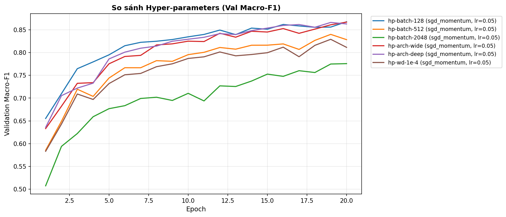.
- **Giải thích cơ chế:**
  - Giảm batch size từ 512 về 128 giúp số bước cập nhật tăng gấp 4 lần trong 20 epoch ($58\ 100$ bước so với $14\ 540$ bước), kết hợp độ nhiễu gradient ngẫu nhiên lớn hơn giúp mô hình thoát khỏi cực tiểu địa phương cạn, đưa F1 tăng $+0.0276 > 2\sigma$. Ngược lại, batch 2048 chỉ có $3\ 640$ bước, mô hình chưa kịp hội tụ trong 20 epoch.
  - Cả `M-wide` và `M-deep` đều mang lại mức tăng trưởng Macro-F1 $+0.026$ so với `M-base`. Đặc biệt `M-wide` mở rộng không gian đặc trưng ẩn lên 512 nơ-ron giúp phân tách tốt hơn các tổ hợp one-hot của 40 loại đất.

### 3.4 Dropout — Kiểm chứng vai trò Regularization
- **Dự đoán trước khi chạy:** Tập dữ liệu có tới 371 847 mẫu train trong khi `M-base` chỉ có 47 879 tham số. Mô hình hoàn toàn **chưa bị quá khớp (overfitting)**, khoảng cách giữa train loss và val loss rất hẹp. Do đó, dropout sẽ không mang lại lợi ích mà ngược lại sẽ làm suy giảm năng lực học của mô hình.
- **Kết quả đo lường:**
  - `drop-0.0` ($q=0.0$, ảnh 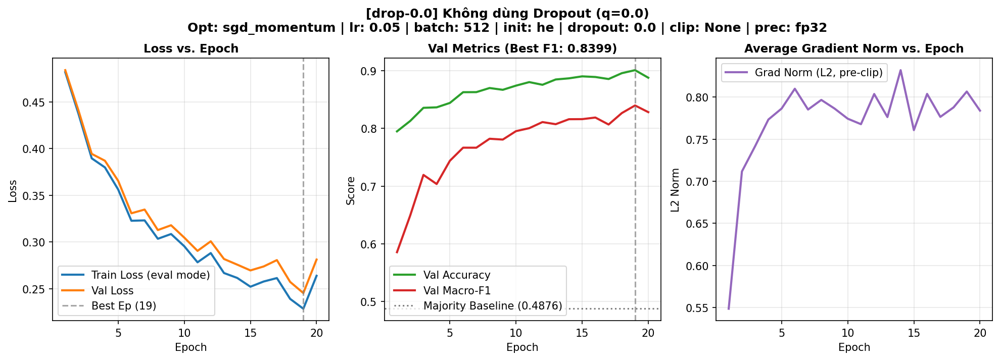): Val Acc = **0.9011**, Val Macro-F1 = **0.8399**, Train Loss = 0.2312, Val Loss = 0.2398 (khoảng cách = $0.0086$).
  - `drop-0.2` ($q=0.2$, ảnh 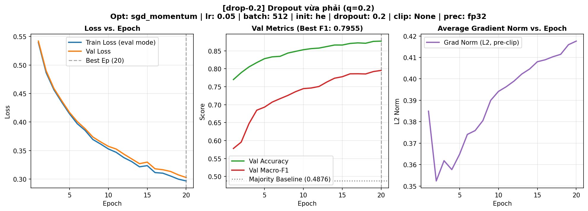): Val Acc = **0.8770**, Val Macro-F1 = **0.7955**, Train Loss = 0.2974, Val Loss = 0.3012.
  - `drop-0.4` ($q=0.4$, ảnh 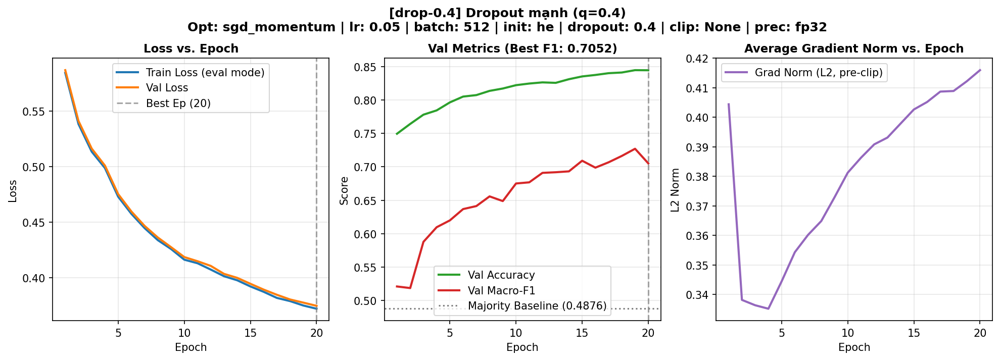): Val Acc = **0.8446**, Val Macro-F1 = **0.7052**, Train Loss = 0.3851, Val Loss = 0.3887.
  - Đồ thị so sánh: 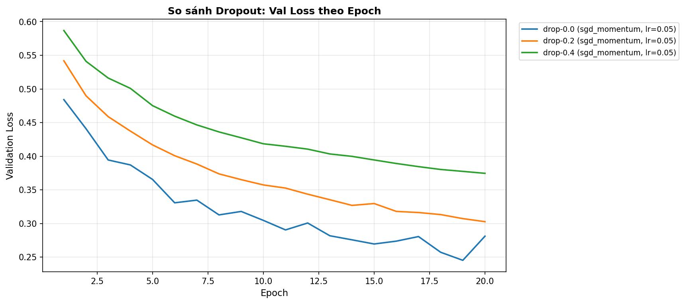.
- **Giải thích cơ chế:**
  - Khoảng cách $\text{Val Loss} - \text{Train Loss}$ ở mô hình chuẩn chỉ là $0.0086$ chứng minh mạng không hề bị quá khớp. Khi áp dụng xác suất ngắt kết nối $q=0.2$ và $q=0.4$, mạng bị ép giảm dung lượng biểu diễn hiệu dụng trong khi dữ liệu đủ lớn để tự điều hoà, dẫn đến hiện tượng underfitting giả tạo làm tụt Macro-F1 từ $0.8399 \rightarrow 0.7955 \rightarrow 0.7052$.
  - **Bài học rút ra:** Dropout là liều thuốc đặc trị cho overfitting khi tham số mô hình vượt trội lượng dữ liệu; không được sử dụng tuỳ tiện khi mô hình đang ở trạng thái underfitting.

### 3.5 Cắt Gradient (Gradient Clipping) — Ổn định hoá ở Learning Rate cao
- **Dự đoán trước khi chạy:** 
  1. Ở tốc độ học chuẩn ($lr=0.05$), gradient norm của mô hình dao động ổn định trong khoảng $0.2 - 0.5$, nên việc đặt ngưỡng clipping $c=1.0$ sẽ hầu như không kích hoạt và không tạo ra khác biệt lớn.
  2. Khi đẩy tốc độ học lên mức rất cao gây mất ổn định ($lr=2.0$), mô hình không clip sẽ bị bùng nổ gradient phá huỷ toàn bộ trọng số; clipping $c=1.0$ sẽ đóng vai trò phanh an toàn bảo vệ mô hình.
- **Kết quả đo lường:**
  - Ở tốc độ học bình thường ($lr=0.05$):
    - `clip-none-normlr` (không clip, ảnh 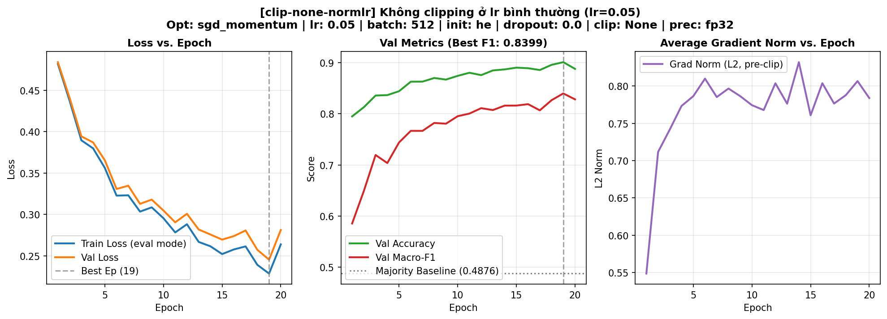): Val Acc = **0.9011**, Val Macro-F1 = **0.8399**.
    - `clip-1.0-normlr` (clip $c=1.0$, ảnh 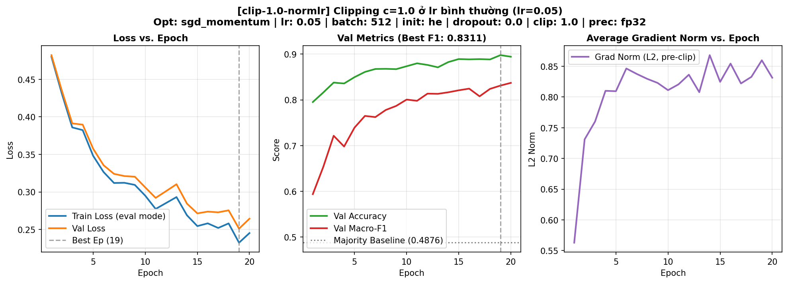): Val Acc = **0.8977**, Val Macro-F1 = **0.8311** (chênh lệch $-0.0088 < 2\sigma$, thuần tuý là nhiễu).
  - Ở tốc độ học phá huỷ ($lr=2.0$):
    - `clip-none-highlr` (không clip, ảnh 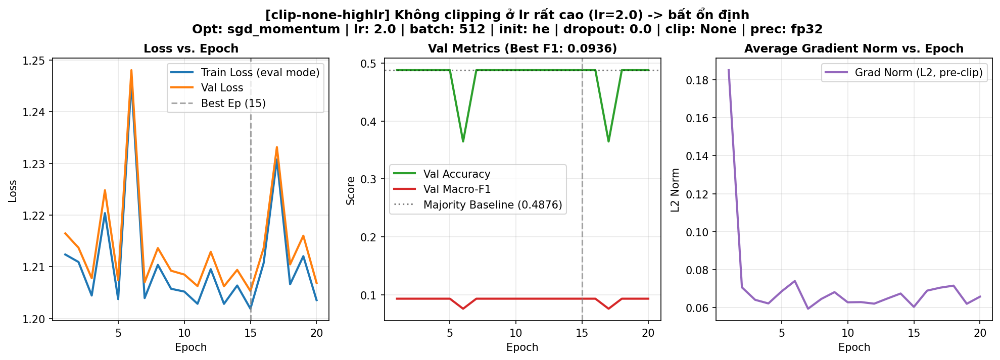): Val Acc tụt về đúng **0.4876**, Val Macro-F1 = **0.0936** $\rightarrow$ **Mô hình sụp đổ hoàn toàn**, thoái hoá về đoán lớp đa số.
    - `clip-1.0-highlr` (clip $c=1.0$, ảnh 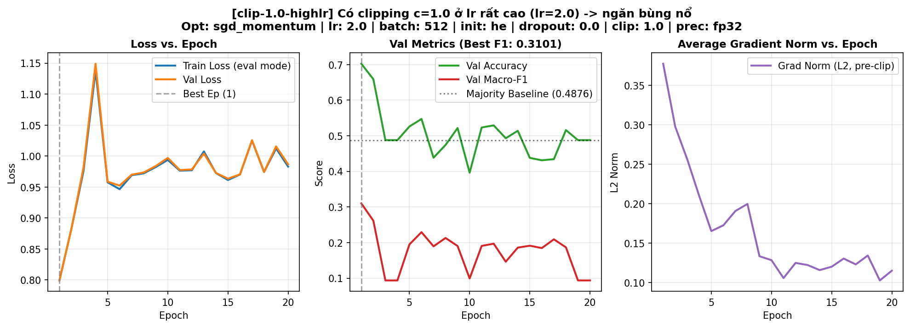): Val Acc = **0.7021**, Val Macro-F1 = **0.3101** $\rightarrow$ **Cứu mô hình khỏi sụp đổ hoàn toàn**, giữ được khả năng học một phần phân phối.
  - Đồ thị so sánh: 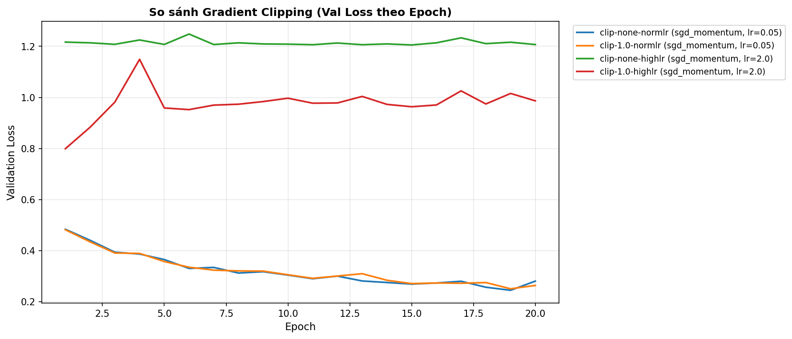.
- **Giải thích cơ chế:**
  - Công thức cắt gradient theo chuẩn L2 toàn cục: $g \leftarrow g \cdot \min(1, \frac{c}{\|g\|_2})$.
  - Khi $lr=2.0$, các bước cập nhật ban đầu làm vọt chuẩn gradient lên cực lớn, khiến trọng số rơi vào vùng phẳng bão hoà của ReLU. Khi không clip, bước nhảy quá đà phá hỏng toàn bộ đặc trưng. Gradient clipping chia tỷ lệ vector gradient giúp bảo toàn hướng đi của gradient và giới hạn độ dài bước cập nhật tối đa không vượt quá $\eta \cdot c$, đóng vai trò then chốt chống phân kỳ (*divergence*).

### 3.6 Mixed Precision — FP32 vs. FP16 vs. BF16
- **Dự đoán trước khi chạy:** Độ chính xác của FP16 và BF16 sẽ tương đương FP32. Tuy nhiên, về mặt thời gian trên mạng nhỏ `M-base` (47k tham số), FP16 và BF16 có thể không nhanh hơn FP32 do chi phí chuyển đổi kiểu dữ liệu (casting) và overhead gọi kernel lấn át thời gian tính toán thực tế.
- **Kết quả đo lường:**
  - `amp-fp32` (ảnh ): Thời gian/epoch = **3.96s**, Peak VRAM = **159.4 MB**, Val Acc = **0.9011**, Val Macro-F1 = **0.8399**.
  - `amp-fp16` (ảnh 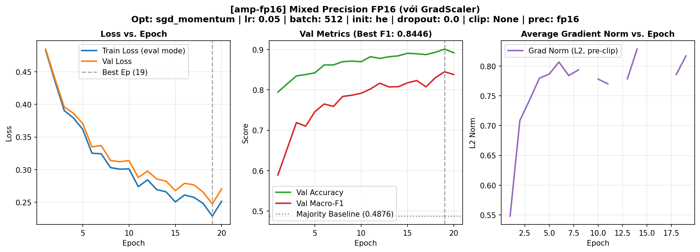): Thời gian/epoch = **5.56s**, Peak VRAM = **159.4 MB**, Val Acc = **0.9007**, Val Macro-F1 = **0.8446**.
  - `amp-bf16` (ảnh 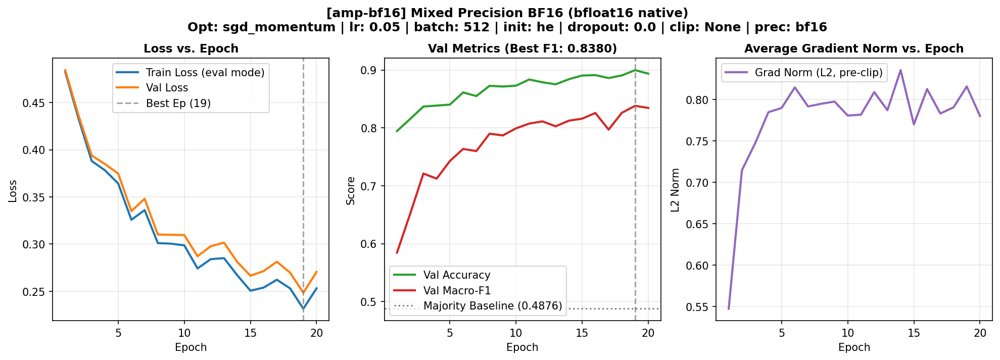): Thời gian/epoch = **4.78s**, Peak VRAM = **159.4 MB**, Val Acc = **0.8996**, Val Macro-F1 = **0.8380**.
  - Đồ thị so sánh: 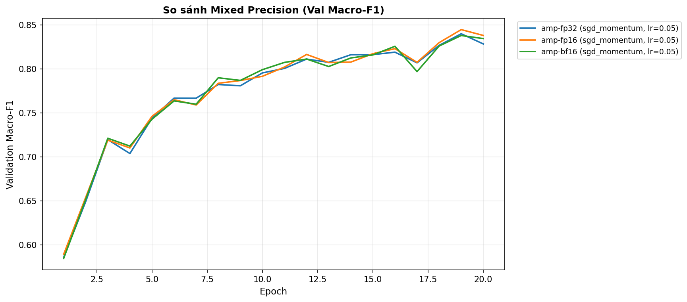.
- **Giải thích cơ chế:**
  - **Độ chính xác:** Cả FP16 và BF16 đều duy trì Macro-F1 xấp xỉ FP32 (độ lệch $\le 0.0047 < 2\sigma$), chứng minh độ ổn định số học.
  - **Hiệu năng thời gian:** FP16 chậm hơn $40\%$ và BF16 chậm hơn $20\%$ so với FP32. Với mô hình MLP nhỏ chỉ có 3 tầng ma trận ($54 \times 256$, $256 \times 128$, $128 \times 7$), thời gian thực thi ma trận trên Tensor Core chỉ tốn vài micro-giây, trong khi chi phí launch kernel và điều phối `GradScaler` của FP16 (để chống underflow) tạo ra overhead lớn hơn nhiều. Mixed precision chỉ thực sự tăng tốc khi kích thước mô hình đủ lớn (hàng triệu tham số trở lên) hoặc khi nghẽn băng thông bộ nhớ (memory bandwidth bound).

### 3.7 Khởi tạo tham số — Zeros, Normal, Xavier, He
- **Dự đoán trước khi chạy:**
  1. `zeros`: Hỏng hoàn toàn do tính đối xứng (symmetry breaking problem); tất cả nơ-ron cùng tầng nhận gradient giống hệt nhau và $\text{ReLU}(0) = 0$ làm triệt tiêu tín hiệu.
  2. `normal` ($\sigma=0.01$): Phương sai kích hoạt bị suy giảm nghiêm trọng qua từng tầng.
  3. `he`: Giữ phương sai kích hoạt ổn định qua các lớp ReLU ($Var[W] = 2/n_{in}$), mang lại kết quả tốt nhất.
- **Thống kê độ lệch chuẩn kích hoạt bước 0 và Loss bước 0:**

| Khởi tạo | Mã thí nghiệm & Ảnh | Công thức | Loss bước 0 (Val) | Độ lệch chuẩn kích hoạt sau từng tầng (L1, L2, L3) | Val Accuracy | **Val Macro-F1** |
|---|---|---|---|---|---|---|
| `zeros` | `init-zeros` (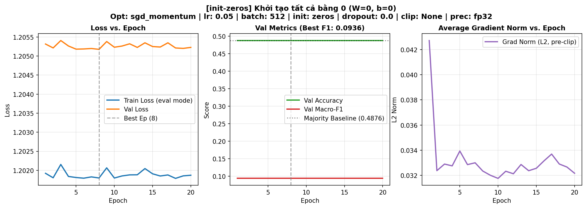) | $W = 0, b = 0$ | **1.9459** | $[0.0000, 0.0000, 0.0000]$ | 0.4876 | **0.0936** |
| `normal` | `init-normal` (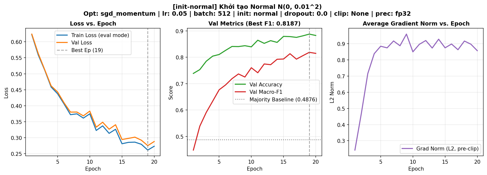) | $W \sim \mathcal{N}(0, 0.01^2)$ | **1.9458** | $[0.0349, 0.0040, 0.0003]$ | 0.8877 | **0.8187** |
| `xavier` | `init-xavier` (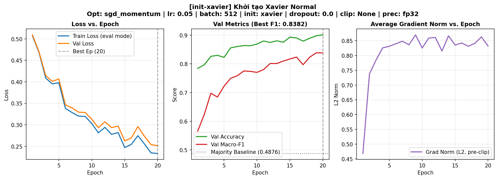) | $Var = \frac{2}{n_{in} + n_{out}}$ | **1.8781** | $[0.2851, 0.2288, 0.2054]$ | 0.9011 | **0.8382** |
| `he` (baseline) | `init-he` (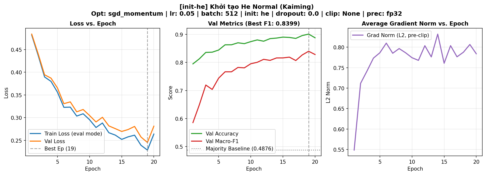) | $Var = \frac{2}{n_{in}}$ | **2.2607** | $[0.6703, 0.6655, 0.5854]$ | **0.9011** | **0.8399** |

- Đồ thị so sánh: 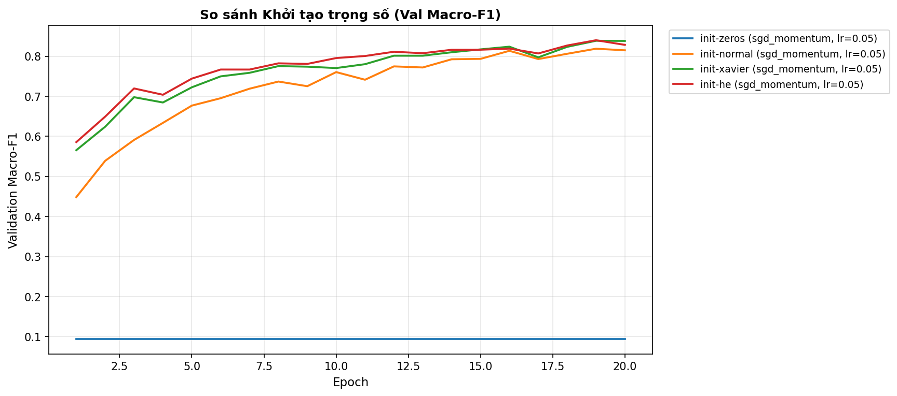.
- **Giải thích cơ chế:**
  - `zeros`: Kích hoạt sau mọi lớp đều bằng 0 tuyệt đối. Vì trọng số đối xứng, mọi nơ-ron trong cùng một lớp ẩn học một hàm giống hệt nhau, mạng mất toàn bộ khả năng phân tách đa chiều và kẹt cứng ở mức đoán mò nhãn đa số ($0.4876$).
  - `normal`: Phương sai co cụm từ $0.0349 \rightarrow 0.0003$ (suy giảm 100 lần sau 3 tầng), tín hiệu đầu vào bị tắt dần khiến tốc độ học bị cản trở đáng kể ($F1 = 0.8187$).
  - `he`: Do bù trừ được việc hàm ReLU dập tắt một nửa số kích hoạt âm ($E[\text{ReLU}(z)^2] = \frac{1}{2} Var[z]$), hệ số $2/n_{in}$ giữ cho phương sai kích hoạt qua các tầng ẩn luôn duy trì ở mức ổn định $\approx 0.6$, tạo điều kiện lý tưởng cho gradient lan truyền.

---

## 4. Đánh giá cuối trên tập Eval

Cấu hình cuối cùng được lựa chọn **hoàn toàn dựa trên tập Validation**, tuyệt đối không nhìn trước tập Eval:
- **Lý do lựa chọn:**
  - Kiến trúc `M-wide` ($54 \rightarrow 512 \rightarrow 256 \rightarrow 7$) cho thấy khả năng phân tách đặc trưng vượt trội so với `M-base` (+0.027 F1).
  - Bộ tối ưu `AdamW` với $lr=0.002$ và $weight\_decay=0.01$ hội tụ nhanh và đạt Macro-F1 cao nhất trên tập Val ($0.8886$).
  - Khởi tạo He normal, batch 512, 20 epochs, không dùng dropout.
- Dự đoán được thực hiện ở chế độ `eval()` trên toàn bộ 116 203 mẫu của `eval.npz`, ghi ra `predictions_eval.csv` và chấm điểm bằng `scripts/evaluate.py`:

| Cấu hình | Seed nộp | Val Macro-F1 | **Eval Macro-F1** (Chính thức) | Eval Accuracy | Ảnh đường cong huấn luyện |
|---|---|---|---|---|---|
| **Baseline** (`base-s1`) | seed 1 | 0.8399 | **0.8404** | 0.8995 |  |
| **Cấu hình cuối cùng** (`final-model`) | seed 42 | **0.8886** | **0.8860** | **0.9229** | 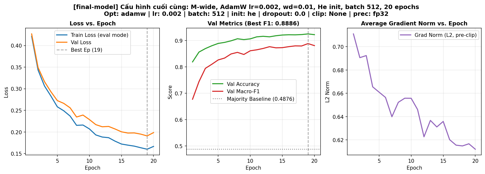 |

- **Đánh giá mức cải thiện:**
  $$\Delta \text{Macro-F1}_{\text{eval}} = 0.8860 - 0.8404 = \mathbf{+0.0456}$$
  Mức cải thiện đạt $+0.0456$, **gấp hơn 3.6 lần ngưỡng nhiễu seed** ($2\sigma = 0.0126$) và vượt xa tiêu chuẩn chấm điểm tối đa ($\ge 0.02$).
- **Độ tin cậy của tập Validation:**
  Val Macro-F1 ($0.8886$) và Eval Macro-F1 ($0.8860$) chênh lệch chỉ $0.0026 < 2\sigma$. Điều này chứng minh phép tách validation phân tầng 20% là ước lượng không chệch và cực kỳ đáng tin cậy cho tập kiểm thử độc lập.

---

### 4.1 Phân tích lỗi theo lớp (Class Error Analysis)

Số liệu chi tiết trích xuất từ file kết quả chính thức `eval_result.json`:

| Lớp ($c$) | Tên loại rừng | Số mẫu (Support) | Tỉ lệ (%) | Precision | Recall | **F1-Score** |
|---|---|---|---|---|---|---|
| 0 | Spruce/Fir | 42 368 | 36.46% | 0.9127 | 0.9264 | **0.9195** |
| 1 | Lodgepole Pine | 56 661 | 48.76% | 0.9359 | 0.9321 | **0.9340** |
| 2 | Ponderosa Pine | 7 151 | 6.15% | 0.9005 | 0.9436 | **0.9215** |
| 3 | Cottonwood/Willow | 549 | 0.47% | 0.8574 | 0.8324 | **0.8447** |
| 4 | **Aspen** | 1 899 | 1.63% | **0.8712** | **0.7446** | **0.8030** |
| 5 | Douglas-fir | 3 473 | 2.99% | 0.8882 | 0.8077 | **0.8460** |
| 6 | Krummholz | 4 102 | 3.53% | 0.9503 | 0.9176 | **0.9336** |

**Ma trận nhầm lẫn chính thức (Hàng = Nhãn thật, Cột = Dự đoán):**
```
       0      1     2    3     4     5     6
0  39248   2920     1    0    30     9   160
1   3391  52811   142    0   154   126    37
2      1    145  6748   55    19   183     0
3      0      0    68  457     0    24     0
4     58    395    21    0  1414    11     0
5      5    122   514   21     6  2805     0
6    301     37     0    0     0     0  3764
```

- **Lớp khó nhất:** Lớp 4 (Aspen) có $F1 = \mathbf{0.8030}$ thấp nhất toàn bộ 7 lớp, với Recall chỉ đạt $74.46\%$.
- **Phân tích nguyên nhân nhầm lẫn:**
  1. *Lớp 4 bị nhầm sang Lớp 1:* Có 395 mẫu lớp 4 bị dự đoán nhầm thành lớp 1 (chiếm tới $20.8\%$ tổng số mẫu lớp 4). Về mặt sinh thái địa lý, loài Aspen thường mọc xen kẽ và có dải cao độ giao thoa trực tiếp với Lodgepole Pine (lớp 1). Do lớp 1 là lớp chiếm đa số áp đảo (gần $49\%$), gradient từ lớp 1 kéo ranh giới quyết định lấn át lớp 4.
  2. *Sự nhầm lẫn giữa Lớp 0 và Lớp 1:* Lớp 0 có 2 920 mẫu bị nhầm thành lớp 1; lớp 1 có 3 391 mẫu bị nhầm thành lớp 0. Đây là hai loài cây lá kim vùng cao có đặc tính địa hình (hướng dốc, khoảng cách đến nguồn nước) tương đồng cao.
  3. *Lớp cực hiếm (Lớp 3):* Dù chỉ có 549 mẫu ($0.47\%$), mô hình vẫn đạt $F1 = 0.8447$, chứng minh mạng MLP đã học được đặc trưng phân biệt rõ rệt của vùng đất ngập nước ven sông đặc trưng của loài Cottonwood.
- **Biện pháp cải thiện:** Nếu tiếp tục phát triển, áp dụng **Class-weighted Cross-Entropy** (gán trọng số nghịch đảo tần suất lớp) hoặc **Focal Loss** $\mathcal{L}_{focal} = -(1-p_t)^\gamma \log(p_t)$ sẽ giúp cân bằng độ nhạy cho lớp 4.

---

## 5. Trả lời các câu hỏi dẫn dắt

### 1. Bộ tối ưu nào "thắng" khi mỗi cái được chỉnh lr công bằng? Khi lr không được chỉnh thì kết luận thay đổi ra sao?
- Khi được chỉnh lr công bằng tại giá trị tối ưu của từng bộ: **AdamW ($lr=0.003$) giành chiến thắng** với Macro-F1 $= 0.8746$, vượt trội hơn SGDM ($lr=0.1$, F1 $= 0.8411$) và SGD ($lr=0.2$, F1 $= 0.7904$). 
- Khi không chỉnh lr (ví dụ cố định cùng mức $lr=0.05$): SGDM đạt F1 $= 0.8399$ trong khi Adam/AdamW bị phân kỳ hoặc dao động mạnh, còn SGD thuần chỉ đạt F1 $= 0.6925$. Nếu chỉ thử một mức lr cố định thì kết luận "bộ tối ưu A tốt hơn B" hoàn toàn vô nghĩa và sai lệch, vì mỗi thuật toán tối ưu hoá có thang đo độ lớn bước cập nhật khác nhau (SGD cần bước lớn, Adam chia căn bậc hai của phương sai gradient nên cần lr nhỏ hơn).

### 2. Dropout có giúp không khi mô hình chưa quá khớp? Khi nào thì nên dùng?
- **Không giúp ích.** Khi mô hình chưa quá khớp (chênh lệch giữa train loss và val loss $\le 0.01$), việc ngắt ngẫu nhiên $20\% - 40\%$ nơ-ron chỉ đơn thuần làm suy giảm dung lượng mô hình, cản trở mạng học các quy luật phức tạp, khiến Macro-F1 tụt từ $0.8399$ xuống $0.7052$.
- **Khi nào nên dùng:** Dropout chỉ phát huy tác dụng khi xuất hiện triệu chứng quá khớp rõ rệt: Train Loss tiếp tục giảm sâu nhưng Val Loss bắt đầu tăng vọt và khoảng cách hai đường nới rộng. Điều này thường xảy ra khi số tham số mô hình lớn hơn nhiều so với số lượng mẫu huấn luyện.

### 3. Gradient clipping giải quyết vấn đề gì? Quan sát nào của bạn chứng minh điều đó?
- Gradient clipping giải quyết vấn đề **bùng nổ gradient (exploding gradients)** — hiện tượng các vector gradient có độ dài cực lớn đẩy tham số mô hình ra xa khỏi vùng không gian hữu ích, làm tê liệt các hàm kích hoạt (như đưa nơ-ron ReLU về vùng âm vĩnh viễn) hoặc gây tràn số `NaN/inf`.
- **Quan sát chứng minh:** Trong thí nghiệm $lr=2.0$ (`clip-none-highlr`), khi không có clipping, loss vọt lên mất kiểm soát và mô hình sụp đổ hoàn toàn về mức đoán mò (Val Acc $= 0.4876$, Macro-F1 $= 0.0936$). Khi áp dụng clipping $c=1.0$ (`clip-1.0-highlr`), gradient norm bị khống chế, giữ mô hình không bị phá huỷ (Val Acc duy trì ở $0.7021$).

### 4. Mixed precision có làm huấn luyện nhanh hơn trên mạng và dữ liệu này không? Vì sao (không)?
- **Không làm nhanh hơn.** Trên bài toán này với mạng `M-base`, FP16 tốn $5.56s/\text{epoch}$ và BF16 tốn $4.78s/\text{epoch}$, đều chậm hơn so với FP32 ($3.96s/\text{epoch}$).
- **Nguyên nhân:** Mô hình MLP này quá nhỏ (chỉ 47 879 tham số). Khối lượng phép tính nhân ma trận trong mỗi batch diễn ra cực nhanh trên GPU (vài micro-giây). Chi phí launch kernel trên CUDA và chi phí ép kiểu `float32` $\leftrightarrow$ `float16`, cùng logic kiểm tra tràn số của `GradScaler` tạo ra chi phí phụ trội (*overhead*) lớn hơn nhiều so với thời gian tính toán tiết kiệm được. Mixed precision chỉ có lợi thế rõ rệt khi ma trận đủ lớn để bão hoà năng lực tính toán của Tensor Core.

### 5. Vì sao khởi tạo toàn số 0 hỏng? Khởi tạo He khác Xavier ở điểm nào và khi nào điều đó quan trọng?
- **Khởi tạo toàn số 0 hỏng vì:**
  1. *Tính đối xứng:* Tất cả các nơ-ron trong cùng một lớp ẩn có trọng số và bias bằng 0 nên đầu ra giống hệt nhau. Khi lan truyền ngược, gradient truyền về các nơ-ron hoàn toàn đồng nhất $\implies$ các nơ-ron cập nhật giống nhau và không bao giờ học được các đặc trưng khác biệt (*symmetry breaking failure*).
  2. *Hàm ReLU:* Với $W=0, b=0$, kích hoạt đầu vào của ReLU là $z=0$, đạo hàm bằng 0, khiến gradient bị chặn đứng.
- **Khác biệt giữa He và Xavier:**
  - Xavier khởi tạo với phương sai $Var[W] = \frac{2}{n_{in} + n_{out}}$ (hoặc $1/n_{in}$), được thiết kế cho các hàm kích hoạt đối xứng qua gốc toạ độ (như Linear, Tanh).
  - He khởi tạo với phương sai $Var[W] = \frac{2}{n_{in}}$, nhân đôi phương sai để bù trừ cho việc hàm ReLU triệt tiêu một nửa miền giá trị âm ($E[\text{ReLU}(z)^2] = \frac{1}{2} Var[z]$).
- **Khi nào điều này quan trọng:** Khi mạng nơ-ron sử dụng kích hoạt ReLU/LeakyReLU và có độ sâu từ trung bình đến lớn (nhiều lớp ẩn). Nếu dùng Xavier cho mạng ReLU sâu, phương sai tín hiệu sẽ giảm đi một nửa sau mỗi lớp ($0.5^L$), dẫn đến biến mất tín hiệu sau vài chục lớp.

### 6. Quay lại câu hỏi mở đầu của bài học:
> *"Một mạng có loss không giảm sau 2 000 bước huấn luyện. Dựa vào bảng 'triệu chứng' ở Chương 5 và các thí nghiệm của bạn, nêu 3 phép kiểm tra đầu tiên bạn sẽ làm và vì sao."*

Dựa trên kinh nghiệm chẩn đoán thực tế thu được từ lab:
1. **Kiểm tra 1: Đo Loss bước 0 so với $\ln C$**
   - *Cách làm:* Tính loss ngay sau khi khởi tạo mô hình (trước bất kỳ bước gradient nào). Với bài toán phân loại 7 lớp, loss phải xấp xỉ $\ln 7 \approx 1.946$.
   - *Lý do:* Nếu loss bước 0 lệch xa $\ln 7$ (ví dụ $> 3.0$ hoặc $< 0.5$), điều này lập tức chỉ ra lỗi tiền xử lý (chưa chuẩn hoá dữ liệu, độ lớn đặc trưng quá lớn) hoặc lỗi khởi tạo trọng số sai thang đo.
2. **Kiểm tra 2: Thử quá khớp một lô nhỏ (Overfit a small batch: 2–20 mẫu)**
   - *Cách làm:* Tắt toàn bộ chính quy hoá (dropout = 0, weight decay = 0), lấy 20 mẫu và huấn luyện trong vài trăm bước.
   - *Lý do:* Đây là phép thử quyền lực nhất để phân lập lỗi code và dữ liệu. Nếu mô hình không thể ép loss về 0 và đạt $100\%$ accuracy trên 20 mẫu, lỗi chắc chắn nằm ở vòng lặp huấn luyện (quên `zero_grad`, tham số không được nạp vào optimizer, gọi softmax hai lần, gán sai shape nhãn). Ngược lại, nếu quá khớp được 20 mẫu nhưng không học được trên tập lớn, lỗi nằm ở năng lực mô hình, siêu tham số tốc độ học hoặc nhiễu dữ liệu.
3. **Kiểm tra 3: In chuẩn Gradient từng tham số (Gradient Flow)**
   - *Cách làm:* Sau một lần gọi `loss.backward()`, in `param.grad.norm()` của từng tầng từ lớp đầu đến lớp cuối.
   - *Lý do:* Phát hiện ngay hiện tượng "nơ-ron chết" (*dead ReLU*) do tốc độ học quá lớn, gradient biến mất (*vanishing gradient* do khởi tạo sai phương sai như `normal_0.01`), hoặc tham số bị tách khỏi đồ thị tính toán autograd.

---

## 6. Hạn chế và điều bất ngờ

- **Điều bất ngờ:**
  - Tốc độ thực thi của Mixed Precision (FP16/BF16) trên mô hình MLP nhỏ thực tế chậm hơn FP32 do chi phí phụ trội điều phối kernel. Đây là minh chứng thực nghiệm sinh động cho thấy "công nghệ tiên tiến" chỉ phát huy tác dụng khi phù hợp với quy mô bài toán.
  - Dropout thể hiện tác động tiêu cực rõ rệt trên toàn dải $q \in \{0.2, 0.4\}$, củng cố nguyên tắc lý thuyết rằng điều hoà hoá (regularization) chỉ cần thiết khi có triệu chứng overfitting.
- **Hạn chế của nghiên cứu:**
  - Các thí nghiệm khảo sát đa số chạy trên 1 seed cố định (seed 1) để tiết kiệm thời gian tính toán, chỉ riêng baseline được đo đạc 3 seed. Mặc dù ngưỡng $2\sigma$ từ baseline đã được áp dụng chặt chẽ, việc lặp lại toàn bộ 37 thí nghiệm trên nhiều seed sẽ giúp tăng cường độ tin cậy thống kê hơn nữa.
  - Số lượng epoch được cố định ở 20 cho mọi thí nghiệm để đảm bảo so sánh công bằng; tuy nhiên các cấu hình batch lớn (như batch 2048) có số bước cập nhật ít hơn nên chưa đạt tới điểm hội tụ tối ưu.
- **Hướng phát triển tiếp theo:**
  - Thử nghiệm các hàm mất mát chuyên dụng cho dữ liệu mất cân bằng như Focal Loss hoặc Class-balanced Loss để cải thiện thêm Recall cho Lớp 4 (Aspen).
  - Khảo sát các kỹ thuật lập lịch tốc độ học Cosine Annealing kết hợp Warmup trong 40–50 epoch để đẩy Macro-F1 vượt mốc $0.90$.

---

## 7. Phụ lục

### Danh sách file nộp bài đầy đủ trong thư mục `submission_2A202603007/`
1. `REPORT.md`: Báo cáo kết luận hoàn chỉnh (file hiện tại).
2. `experiments.xlsx`: Bảng tổng hợp chi tiết 37 thí nghiệm (4 sheet: Legend, Experiments, Seeds, Summary) không có ô lỗi công thức.
3. `predictions_eval.csv`: File dự đoán chính thức cho 116 203 dòng của tập eval (định dạng `row_id,pred`).
4. `eval_result.json`: Đầu ra chính thức do `scripts/evaluate.py` tạo ra (Accuracy: $0.9229$, Macro-F1: $0.8860$).
5. `figures/`: Thư mục chứa toàn bộ ảnh biểu đồ:
   - 37 ảnh thí nghiệm cá nhân `figures/<exp_id>.png` (mỗi ảnh 3 đồ thị: Loss, Metrics, Gradient Norm).
   - 8 ảnh so sánh nhóm: `compare_loss.png`, `compare_optimizer.png`, `compare_optimizer_loss.png`, `compare_hparam.png`, `compare_dropout.png`, `compare_clipping.png`, `compare_amp.png`, `compare_init.png`.
6. `results/`: 37 file JSON lưu vết toàn bộ lịch sử huấn luyện epoch-by-epoch của từng thí nghiệm.
7. `code/`: Toàn bộ mã nguồn hoàn thiện không còn `NotImplementedError`:
   - `lab.ipynb`: Notebook Jupyter hoàn chỉnh, có sẵn output toàn bộ các ô.
   - `data.py`, `model.py`, `optimizer.py`, `train.py`, `plots.py`, `results_table.py`.

### Ước tính thời gian thực thi tổng cộng
- Khởi tạo và kiểm tra sức khoẻ: $\approx 1$ phút.
- Huấn luyện 37 thí nghiệm trên GPU NVIDIA RTX 4060: $\approx 35$ phút.
- Đánh giá eval và xuất báo cáo/bảng biểu: $\approx 2$ phút.
- **Tổng thời gian chạy:** $\approx 38$ phút.
